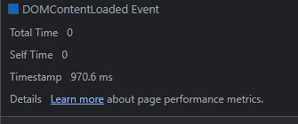

# Использование Chrome DevTools - анализ открытия сайта.

1.  Network

    1.1 записать и сохранить в HAR архив профиль загрузки ресурсов при открытии страницы

    [Har файл](/src/www.gd.ru.har)

    1.2 найти неоптимальные места:

    1.2.1 дублирование ресурсов

    [duplicates.txt](/duplicates.txt) - в файле список url с дублямии запросов.

    a.bundle.js

    [Скриншот](src/duplicates/a.bundle.jpg)

    all.2.js

    [Скриншот](src/duplicates/all.2.jpg)

    Бандлы bootstrap

    [Скриншот](src/duplicates/bootstrap.jpg)

    cast_sender.js

    [Скриншот](src/duplicates/cast_sender.jpg)

    code.js

    [Скриншот](src/duplicates/code.jpg)

    common.js

    [Скриншот](src/duplicates/common.jpg)

    jquery

    [Скриншот](src/duplicates/jquery.jpg)

    lib

    [Скриншот](src/duplicates/lib.jpg)

    loader.js

    [Скриншот](src/duplicates/loader.jpg)

    polezno.js

    [Скриншот](src/duplicates/polezno.jpg)

    popper.js

    [Скриншот](src/duplicates/popper.jpg)

    Css Бандлы bootstrap

    [Скриншот](src/duplicates/bootstrap_css.jpg)

    файлы со стилями

    [Скриншот](src/duplicates/all.jpg)

    2 одинаковые картинки

    [Скриншот](src/duplicates/img.jpg)

    2 баннера рамблер

    [Скриншот](src/duplicates/rambler100.jpg)

    1.2.2 лишний размер ресурса

    Файлы JS с большим весом

    [Скриншот](src/js_big_size.jpg)

    Файлы CSS с большим весом

    [Скриншот](src/css_big_size.jpg)

    Файлы IMG с большим весом. Присутствуют изображения в формате png с большим весом, у которых нет прозрачного фона. Например:

    -   image_2022_12_27T08_36_05_297Z.png
    -   Snimok.PNG
    -   linkTo\_\_sprite.png - спрайт иконок
    -   makves_mini2.png
    -   fns-obnovila-bazu-dolgov-kompaniy-pered-byudjetom3.png

    [Скриншот](src/img_big_size.jpg)

    Шрифты с большим весом

    [Скриншот](src/fonts_big_size.jpg)

    1.2.3 медленно загружающиеся ресурсы

    Сделана выборка ресурсов с показателем Time > 150 ms

    

    

    

    1.2.4 ресурсы, блокирующие загрузку

    

    1.2.5 что-то ещё

    CORS-errors:

    -   `https://www.law.ru/images/fonts/proxima-nova.ttf`
    -   `https://api.action-media.ru/auth/check-backend/api/v2/auth_check`

    [Скриншот Network с корс ошибками](src/blocked_requests.jpg)

    Запросы с ошибками:

    -   `https://play.google.com/log?format=json&hasfast=true&authuser=0`
    -   `https://googleads.g.doubleclick.net/pagead/id`
    -   `https://static.doubleclick.net/instream/ad_status.js`
    -   `https://yt3.ggpht.com/1LwGipwHZu5_qOiZOXZ7kjeKv8lTcCt426WCqCb1B3pq3IjULe8nETElArV6QACburVzdomA3aU=s68-c-k-c0x00ffffff-no-rj`

    [Скриншот Network с ошибками](src/errors.jpg)

2.  Performance

    2.1 записать и сохранить в файл профиль загрузки страницы

    [Trace.json](/src/Trace-20230618T135449.json)

    2.2 измерить время в миллисекундах от начала навигации до событий First Paint (FP), First Contentful Paint (FCP), Largest Contentful Paint (LCP), DOM Content Loaded (DCL), Load

    -   First Paint - 534.5 ms

    

    -   First Contentful Paint - 534.5 ms

    

    -   Largest Contentful Paint - 1207.2 ms

    

    -   DOM Content Loaded - 970.6 ms

    

    -   Load - 41678.1 ms

    

    2.3 определить, на каком DOM-элементе происходит LCP

    -   ``

    

    2.4 измерить, сколько времени в миллисекундах тратится на разные этапы обработки документа (Loading, Scripting, Rendering, Painting)

    -   Loading - 38 ms
    -   Scripting - 1607 ms
    -   Rendering - 255 ms
    -   Painting - 24 ms

    

3.  Coverage

    3.1 сохранить скриншот вкладки после загрузки страницы

    [Coverage](src/coverage.jpg)

    [Coverage_css.jpg](src/coverage_css.jpg)

    [Coverage_js.jpg](src/coverage_js.jpg)

    3.2 измерить в килобайтах объём неиспользованного CSS в ходе загрузки страницы

    -   566 KB

    3.3 измерить в килобайтах объём неиспользованного JS в ходе загрузки страницы

    -   2300 KB

# Дополнительное задание - замедление CPU 4x slowdown и эмуляцию сети Slow 3G.

1.  Network

    1.1 записать и сохранить в HAR архив профиль загрузки ресурсов при открытии страницы

    [Har файл](/src/slow/www.gd.ru.har)

    1.2 найти неоптимальные места:

    1.2.3 медленно загружающиеся ресурсы

    Сделана выборка ресурсов с показателем Time > 9 s

    

    1.2.4 ресурсы, блокирующие загрузку

    
    

2.  Performance

    2.1 записать и сохранить в файл профиль загрузки страницы

    [Trace.json](https://disk.yandex.ru/d/nEzlxNr04gwP2Q)

    2.2 измерить время в миллисекундах от начала навигации до событий First Paint (FP), First Contentful Paint (FCP), Largest Contentful Paint (LCP), DOM Content Loaded (DCL), Load

    -   First Paint - 70367.2 ms

    

    -   First Contentful Paint - 70367.2 ms

    

    -   Largest Contentful Paint - 70367.2 ms

    

    -   DOM Content Loaded - 39803.2 ms

    

    -   Load - 102325.6 ms

    

    2.3 определить, на каком DOM-элементе происходит LCP

    -   `<h1 class="page__title" itemprop="headline name">Финансовый контроль: методы анализа и оценки эффективности</h1>`

    

    2.4 измерить, сколько времени в миллисекундах тратится на разные этапы обработки документа (Loading, Scripting, Rendering, Painting)

    -   Loading - 38 ms
    -   Scripting - 1607 ms
    -   Rendering - 255 ms
    -   Painting - 24 ms

    
