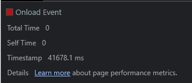

1.  Network

    1.1 записать и сохранить в HAR архив профиль загрузки ресурсов при открытии страницы

    [Har файл](/src/www.gd.ru.har)

    1.2 найти неоптимальные места:

    1.2.1 дублирование ресурсов

    [duplicates.txt](/duplicates.txt) - в файле список url с дублямии запросов.

    a.bundle.js

    

    all.2.js

    

    Бандлы bootstrap

    

    cast_sender.js

    

    code.js

    

    common.js

    

    jquery

    

    lib

    

    loader.js

    

    polezno.js

    

    popper.js

    

    Css Бандлы bootstrap

    

    файлы со стилями

    

    2 одинаковые картинки

    

    2 баннера рамблер

    

    1.2.2 лишний размер ресурса

    Файлы JS с большим весом

    

    Файлы CSS с большим весом

    

    Файлы IMG с большим весом. Присутствуют изображения в формате png с большим весом, у которых нет прозрачного фона. Например:

    -   image_2022_12_27T08_36_05_297Z.png
    -   Snimok.PNG
    -   linkTo\_\_sprite.png - спрайт иконок
    -   makves_mini2.png
    -   fns-obnovila-bazu-dolgov-kompaniy-pered-byudjetom3.png

    

    Шрифты с большим весом

    

    1.2.3 медленно загружающиеся ресурсы

    Сделана выборка ресурсов с показателем Time > 150 ms

    

    

    

    1.2.4 ресурсы, блокирующие загрузку

    

    1.2.5 что-то ещё

    CORS-errors:

    -   https://www.law.ru/images/fonts/proxima-nova.ttf
    -   https://api.action-media.ru/auth/check-backend/api/v2/auth_check

    [Скриншот Network с корс ошибками](src/blocked_requests.jpg)

    Запросы с ошибками:

    -   https://play.google.com/log?format=json&hasfast=true&authuser=0
    -   https://googleads.g.doubleclick.net/pagead/id
    -   https://static.doubleclick.net/instream/ad_status.js
    -   https://yt3.ggpht.com/1LwGipwHZu5_qOiZOXZ7kjeKv8lTcCt426WCqCb1B3pq3IjULe8nETElArV6QACburVzdomA3aU=s68-c-k-c0x00ffffff-no-rj

    [Скриншот Network с ошибками](src/errors.jpg)

2.  Performance

    2.1 записать и сохранить в файл профиль загрузки страницы

    [Trace.json](/src/Trace-20230615T142315)

    2.2 измерить время в миллисекундах от начала навигации до событий First Paint (FP), First Contentful Paint (FCP), Largest Contentful Paint (LCP), DOM Content Loaded (DCL), Load

    -   First Paint - 379.7 ms

    

    -   First Contentful Paint - 379.7 ms

    

    -   Largest Contentful Paint - 1301.0 ms

    

    -   DOM Content Loaded - 1004.5 ms

    

    -   Load - 41958.6 ms

    

    2.3 определить, на каком DOM-элементе происходит LCP

    -   ``

    

    2.4 измерить, сколько времени в миллисекундах тратится на разные этапы обработки документа (Loading, Scripting, Rendering, Painting)

    -   Loading - 43 ms
    -   Scripting - 1618 ms
    -   Rendering - 282 ms
    -   Painting - 23 ms

    

3.  Coverage

    3.1 сохранить скриншот вкладки после загрузки страницы

    [Coverage](src/coverage.jpg)

    [Coverage_css.jpg](src/coverage_css.jpg)

    [Coverage_js.jpg](src/coverage_js.jpg)

    3.2 измерить в килобайтах объём неиспользованного CSS в ходе загрузки страницы

    -   566 KB

    3.3 измерить в килобайтах объём неиспользованного JS в ходе загрузки страницы

    -   2300 KB
